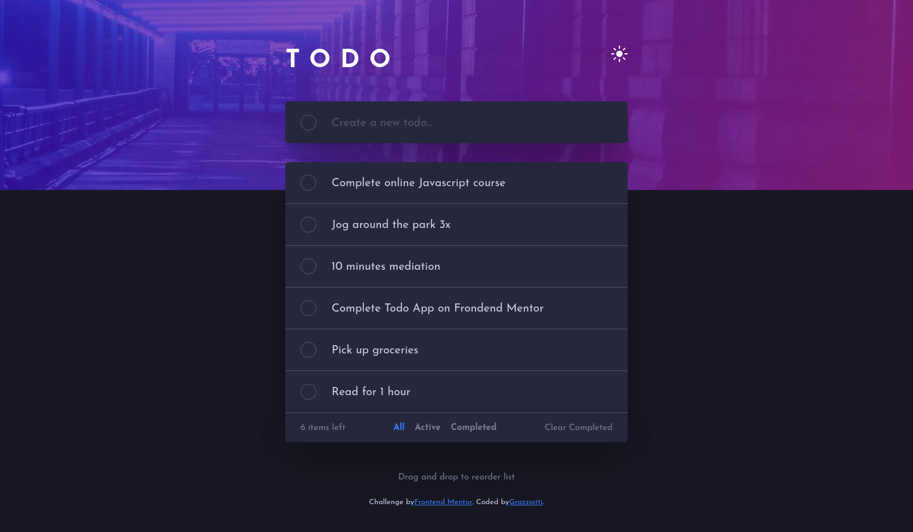

# 📋 ToDo App



## 📄 Descrição

Este projeto é uma solução para o desafio ToDo App do site Frontend Mentor :D

Link da projeto: https://grazziotti.github.io/todo-app/

## 🛠 Tecnologias Utilizadas

- HTML5
- CSS3
- JavaScript

## ✨ Funcionalidades

- [x] Theme switcher
- [x] Criar e deletar tarefas
- [x] Marcar tarefas como concluídas
- [x] Filtrar tarefas (todas, ativas e concluídas)
- [x] Limpar tarefas concluídas
- [x] Ordenar tarefas (drag and drop)
- [x] Dados persistem

## 📋 Pré-requisitos

Antes de começar, você vai precisar ter instalado em sua máquina as seguintes ferramentas: [Git](https://git-scm.com/).

Além disto é bom ter um editor para trabalhar com o código como [VSCode](https://code.visualstudio.com/).

## 🚀 Como Executar

```bash
# Clone este repositório
$ git clone https://github.com/grazziotti/todo-app

# Vá até a pasta do projeto
$ cd todo-app

# Execute o projeto
Abra o arquivo index.html no seu navegador.
```

## 👤 Autor


[Daniel Grazziotti](https://github.com/grazziotti)
